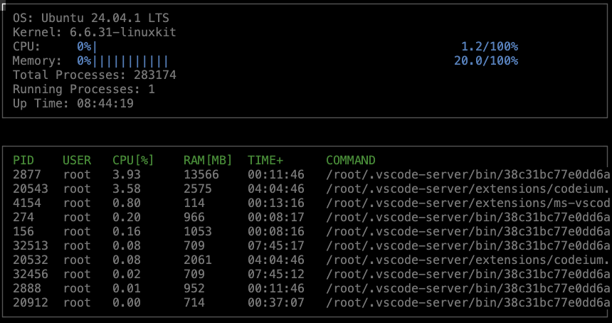

# System-Monitor



## Overview

This project is a simple system monitor that displays system information such as CPU usage, memory usage, running processes, and more in a text-based interface using `ncurses`.

The core components include the following classes:
- **`System`**: Gathers overall system information, including memory utilization, total processes, running processes, and system uptime.
- **`Process`**: Represents individual processes running on the system, providing details like CPU utilization, memory usage, and the command that generated the process.
- **`Processor`**: Represents the CPU and calculates its utilization.
- **`LinuxParser` namespace**: Contains functions that interface directly with the Linux `/proc` filesystem to extract relevant data for system monitoring.

## Installation

This project can be built and run on any Linux environment. Below are the dependencies required and instructions to install them:

1. **Install required packages**:
   - For building the project:
     ```bash
     sudo apt install build-essential g++ cmake
     ```
   - For `ncurses` (for text-based graphical output):
     ```bash
     sudo apt install libncurses5-dev libncursesw5-dev
     ```
   - For code formatting (optional):
     ```bash
     sudo apt install clang-format
     ```

   These instructions are for `apt` (Ubuntu/Debian), but similar packages are available on other Linux distributions through their package managers (e.g., `dnf` for Fedora, `yum` for CentOS, or `pacman` for Arch Linux).

## Build and Run

This project uses [CMake](https://cmake.org/) as the build system and `ncurses` for the terminal UI. The project includes a `CMakeLists.txt` configuration file and a `Makefile` to simplify the build process.

### Steps:

1. **Clone the repository**:
   ```bash
   git clone https://github.com/yourusername/system-monitor.git
   ```

2. **Build the project** using CMake:
   ```bash
   make build
   ```

3. **Run the resulting executable**:
   ```bash
   ./build/monitor
   ```

4. **Optional**: Format the code using `clang-format`:
   ```bash
   make format
   ```

5. **Optional**: Build the project with debugging symbols:
   ```bash
   make debug
   ```

6. **Clean up build artifacts**:
   ```bash
   make clean
   ```

## High-Level Structure

The project consists of the following core classes and namespaces:

- **`System`**: 
  - Retrieves and aggregates system-level data such as CPU and memory utilization, total and running processes, and system uptime.
  - Manages the `Processor` and `Process` objects.
  
- **`Process`**: 
  - Represents an individual process running on the system.
  - Provides access to process-specific data such as PID, user, command, memory usage, and CPU utilization.
  
- **`Processor`**: 
  - Represents the CPU.
  - Responsible for calculating the CPU utilization by interacting with the data from the `/proc` filesystem.

- **`LinuxParser`**:
  - Provides utility functions to interface with the Linux `/proc` filesystem.
  - Extracts information related to the system's processes, CPU, memory, and other resources, which are then used by the `System`, `Process`, and `Processor` classes.

## Project Structure

The project has the following folder structure:
- **`src/`**: Contains the implementation of the `System`, `Process`, `Processor`, and other project logic.
- **`include/`**: Contains the header files for each class and function.
- **`CMakeLists.txt`**: The CMake configuration file to build the project.
- **`Makefile`**: Simplifies the build process with `make` commands.
